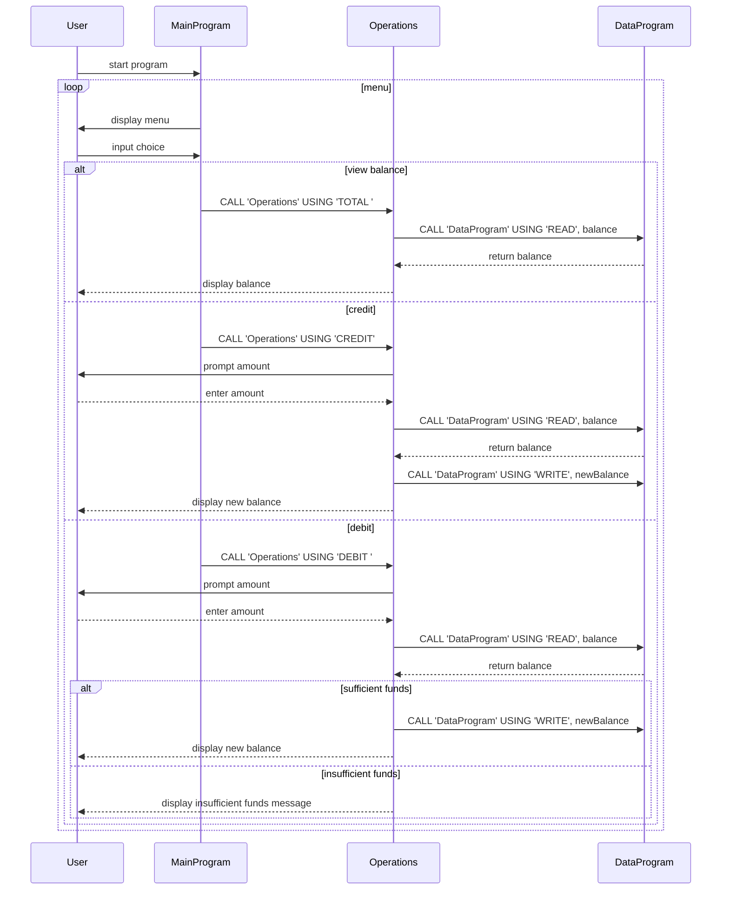

# COBOL Account Management System Documentation

This directory contains documentation for the legacy COBOL account management system. The system simulates simple student account operations including balance inquiry, credit, and debit.

## File Overview

### `main.cob`
- **Purpose:** Entry point of the application. Presents a text-based menu to the user to select account operations.
- **Key logic:**
  - Displays menu choices (view balance, credit, debit, exit).
  - Reads user input and uses `EVALUATE` (COBOL's `switch`) to dispatch to the `Operations` program.
  - Loops until the user chooses to exit.
- **Business rules:** None directly enforced here; it simply hands control to the operations program.

### `operations.cob`
- **Purpose:** Implements the core account operation logic based on a passed operation type.
- **Key sections:**
  - Accepts an operation type (`TOTAL`, `CREDIT`, or `DEBIT`) via the linkage section.
  - For `TOTAL`: reads the current balance and displays it.
  - For `CREDIT`: prompts for an amount, reads the balance, adds the amount, writes the new balance, and displays confirmation.
  - For `DEBIT`: prompts for an amount, reads the balance, checks for sufficient funds before subtracting; if insufficient, displays an error message.
  - Always calls `DataProgram` for reading or writing the balance.
- **Business rules:**
  - A debit operation must not reduce the balance below zero. If the requested debit exceeds the current balance, the operation is denied with an "Insufficient funds" message.

### `data.cob`
- **Purpose:** Simulates persistent storage for the account balance.
- **Key sections:**
  - Maintains a working-storage copy of the balance (`STORAGE-BALANCE`, initialized to 1000.00).
  - Provides a linkage section for operations to request `READ` or `WRITE` actions.
  - On `READ`, moves the stored balance into the passed-back `BALANCE` parameter.
  - On `WRITE`, updates the stored balance with the value provided by the caller.
- **Business rules:**
  - The only persistent state managed is the account balance; no additional validation is performed here.

## Student Account Business Rules

- The system models a simplistic student account with a single numeric balance.
- Starting balance is set to 1000.00 when the program is loaded.
- Credits increase the balance by the specified amount; there is no upper limit.
- Debits decrease the balance but cannot result in a negative value; attempts to overdraw are blocked with a warning.
- Balance inquiries simply return the current amount.

---

This documentation is meant to provide context for developers modernizing or analyzing the legacy COBOL code. Each file plays a distinct role in the menu-driven account management workflow.

## Sequence Diagram

